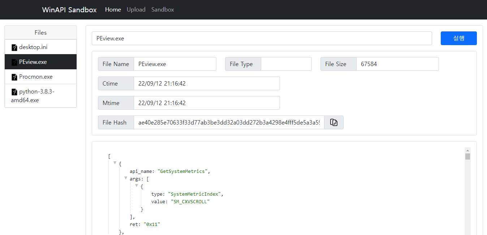

# WinAPI Sandbox

WinAPI Sandbox, based on [VirtualBox](https://www.virtualbox.org/), offer API logging in sandbox environment which most free Sandbox service (e.g anyrun) not serviced in default.


It supply web interface to handling sandbox and its agent.

WinAPI Sandbox is composed with two components, server and agent.

Agent receive server's commands, monitor inner-sandbox environment, execute the program to log winapi as child process and send winapi log to server.

Server handle the sandbox(VirtualBox) by using [vboxmanage](https://www.virtualbox.org/manual/ch08.html), offer web interface to user, transfer user's order.

## Installation

### 1. Clone
```bash
git install https://github.com/orca-eaa5a/py-winapi-box.git
```

### 2. Install Virtual Box
[Download](https://www.virtualbox.org/) Virtualbox that matches with your OS.

### 3. Setup Windows 7/10 Virtual Machine
Check this [Youtube vedio](https://www.youtube.com/watch?v=sBzL_zoYt6o), setup the Windows Guest OS.

Set Guest OS network environment as **Bridged Network**.


Agent has dependency about 
- Visual C++ Redistributable for Visual Studio 2015
- Python3

therefore, you have to install them previously at Guest OS.

After the guest OS installation finished, install the [python3](https://www.python.org/downloads/) and add PATH python installation directory at Guest OS.

Download the [VC Redist 2015](https://www.microsoft.com/en-US/download/details.aspx?id=48145) and install at Guest OS

(Optional) Check this [guide](https://mozi.tistory.com/274) to install VirtualBox guest additions.


### 4. Setup Environment.
#### 1. Agent
1. Copy "agent" folder to guest OS. (location is not matter)
2. Add agent folder absolute path to PATH environment variable.
3. Add autorun.bat to StartUp directory. (In Win7, it's location is **C:\Users\orca\AppData\Roaming\Microsoft\Windows\Start Menu\Programs\Startup**)
4. Edit autorun.bat **--dest option** as your server IP.
5. Install the python modules which agent has dependency with pip3 command
```
pip3 install -r requirments.txt
```

#### 2. Server
1. Install the python modules which server has dependency with pip3 command
```
pip3 install -r requirments.txt
```


## Usage

#### 1. Run Server

```
python server.py
```

#### 2. Open Your Browser

```
localhost:5000/main
```


## Dependency

- [XLogger](https://github.com/andreluizsecco/XLogger)
- [flask](https://flask.palletsprojects.com/en/2.2.x/)